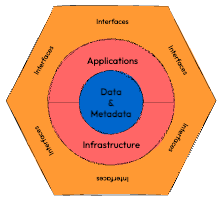

# Serverless Data Product with Bauplan

This example demonstrates how to build a *pure data product* using Bauplan and AWS Lambda — no infrastructure required, fully declarative, and aligned with the `Write-Audit-Publish` pattern.

The product, `yellowTripsDailyStats`, computes and exposes daily average statistics over NYC taxi trips, consuming data from a mock upstream system.


## Overview

This data product computes daily averages over tip, toll, and total amounts of taxi rides in NYC. The result is published via an output port with guaranteed data quality and discoverability, managed through a platform-native descriptor.

All orchestration logic runs in a scheduled AWS Lambda (`handler.py`). All data logic runs in Bauplan (`bpln_pipeline/`).


## Setup and Execution

### 1. Get a Bauplan key

Sign up for the Bauplan sandbox and request an API key:

https://www.bauplanlabs.com/#join

Complete the 3-minute tutorial to verify your setup.

### 2. Configure your AWS account

- Make sure your AWS credentials are available locally and have permissions to deploy Lambdas and access S3.
- Create an S3 bucket and update
    - in [`handler.py`](http://handler.py)

    ```bash
    MY_BUCKET = 'YOUR-BUCKET’
    ```

    - in `serverless.yml`

    ```bash
    arn:aws:s3:::YOUR-BUCKET
    arn:aws:s3:::YOUR-BUCKET/*
    ```


### 3. Install dependencies

You need [Docker installed in your laptop](https://docs.docker.com/desktop/) and running (it will be used to build the Lambda image) and the Serverless framework installed:

```bash
npm install -g serverless@3.40.0
```

### 4. Set your environment variables

Update the `bauplan_user` field in `serverless.yml` to match your Bauplan username.

Then export your Bauplan key:

```bash
export BPLN_KEY=<your_bauplan_key>
export BPLN_USER=<your_bauplan_usename>
```

### 5. Deploy the Lambda

```bash
cd serverless
serverless deploy
```

The Lambda will run every 30 minutes, as configured in `serverless.yml`.

### 6. (Optional) Trigger manually

You can trigger the Lambda manually from the AWS Console.

### 7. (Optional) Test the pipeline interactively

```bash
python3 -m venv venv
source venv/bin/activate
pip install bauplan --upgrade
cd src/bpln_pipeline
bauplan run --namespace tlc_trip_record --dry-run --preview head
```

## Design

This data product follows Hexagonal Architecture:

- **Input port**: a mock stream of NYC TLC trip records
- **Pipeline**: computes daily averages
- **Output port**: publishes summary with data quality guarantees

### Input schema

```
tripsTable:
- tpep_pickup_datetime (string)
- Tip_amount (number)
- Tolls_amount (number)
- Total_amount (number)
```

### Output schema

```
amountStatsTable:
- tripDate (string)
- avgTotal (number)
- avgTip (number)
- avgTolls (number)
```

With expectations:

- No duplicates or nulls in `tripDate`
- Freshness: `tripDate` must be within 1 day from today



## How it Works

1. Mock data is ingested to the input port using the Bauplan SDK.
2. The handler pulls the latest DAG and descriptor from GitHub.
3. A sandbox branch is created and the DAG is run.
4. Quality checks are generated from the descriptor and injected.
5. If checks pass, the output table is merged into `main`.

Failures leave the sandbox open for inspection and rollback.

## Write-Audit-Publish with Bauplan

This product follows the WAP pattern:

- **Write**: to a temporary branch
- **Audit**: quality checks via Arrow-native expectations
- **Publish**: only merge if all checks pass

```bash
bauplan branch create user.my_product
bauplan checkout user.my_product
bauplan run
bauplan merge user.my_product -from main
```

This allows for fast, safe, zero-copy updates with no environment syncing.

## Where to Go From Here?

There are of course a few things that could be improved in this reference implementation, when considering a more realistic and distributed scenario. In no particular order, here are some notes:

- while Lambda based orchestration for the data product itself is great (as long as transformation happens within the Lambda timeout), all the input port manifestation logic should really be in a separate service. We included a mock of streaming data to make the implementation self-contained, but in a real-world scenario the input port would be a separate service that would stream data into the input port;
- by keeping a "mono-repo", we are able to have the descriptor, the lambda (the "outer loop") and the DAG / product logic (the "inner loop") in one place. This is great for a reference implementation, and allows us to download the DAG code and the descriptor dynamically using GitHub as the external source of "code truth". However, different patterns could also work in a real-world scenario: for example, if we mode the DAG to its own repo, we could read the descriptor at the start of the Lambda entry function, and use it to parametrize fully the downstream logic (which is now half-hardcoded, half-dynamic);
- we mostly rely on built-in AWS primitives for logging and monitoring (i.e. log in into CloudWatch). In a real-world scenario we would want to be notified, expecially when things do not go as planned. While Bauplan itself gives programmatic access to Job status and logs, an external process should be in charge of that (and the other, AWS-speficic, traces);
- the mapping between data quality checks as declarative *desiderata* and actual, correct Bauplan code that gets run "on the fly" inside the handler is not done mostly by hard-coding cases and doing quick string templating. We plan to incorporate some of the code-gen functionalities into future releases of the Bauplan SDK, but for now any change to the quality checks would require a change in the handler code.

Everything is left as an exercise for the reader: please do reach out if you end up improving on this design!

**License**

This reference implementation is released under the MIT License. Bauplan is built by [BauplanLabs](https://www.bauplanlabs.com/), all rights reserved.
